# ER-модель: Платформа для онлайн-школи із математики

## Домен

Веб-застосунок для вивчення математики. В ньому учні можуть зареєструватись на курс із математики, відвідувати онлайн-заняття, дивитися курси у записі, отримувати домашні завдання та оплачувати навчання через підписки.

## Сутності

`Parent`, `Student`, `Teacher`, `Course`, `Lesson`, `Homework`, `Homework_submission`, `Subscription`.

## ER-діаграма

Джерело: [model.mmd](model.mmd) (Mermaid `erDiagram`).

## Структура репозиторію

| Файл | Призначення |
| ---- | ----------- |
| `README.md` | Опис домену та навігація |
| `spec.md` | Сутності, атрибути, зв'язки, критерії прийняття |
| `model.mmd` | ER-модель у декларативному синтаксисі |
| `erDiagram.svg` | Рендер діаграми |
| `DEFENSE.md` | Обґрунтування рішень, аудит, ADR |